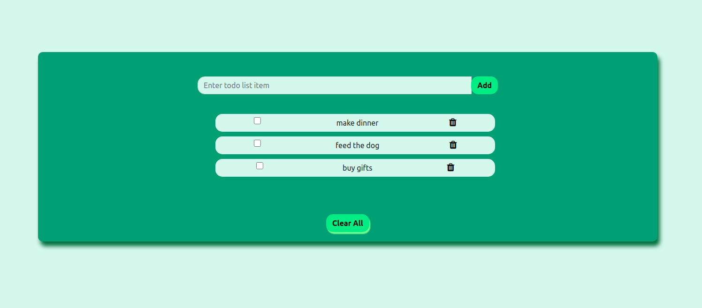

# ToDo-app-node-js-express-js-mongodb

Technology Stack:
Node js
Express js
Mongo DB
Html
CSS

The project uses express routes to post update and delete the data in the mongodb database and subsequently render results on the website for the user.

Features:
Add a new task 
Delete a tasks 
Update tasks as done
Delete all the tasks

